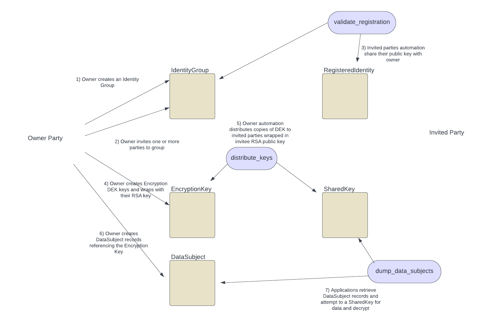

#  Sensitive Data Storage in Daml/Canton

This sample demonstrates a way to distribute sensitive data using On/Off-Ledger encryption.

## I. Overview 

Various privacy and payment regulations recommend the use of encryption to protect sensitive data. Sensitive data might include PII, PHI, payment or credit card data. 

Out of the box, Daml/Canton provides protection without encryption in the following forms:

- Native enforcement of access in the Daml data model and workflows. 
  - Parties can only see contracts for which they are stakeholders.
- Native privacy through the partial, segmented distribution of data only to stakeholders and their participants. 
  - Canton only replicates copies of contracts to participant nodes of stakeholder parties. Other participants are unaware of the transactions or data, nor receive a copy.
- Ability to prune the ledger to remove archived copies of data ("Right to Forget"). 
  - Canton allows for controlled pruning of the ledger contents to purge archive contracts 

In many cases, the above may be sufficient for your business use case.

However, many companies demand additional protection in the form of data encryption. The goals of encryption include the following:

- Protecting from Database Admin (DBA) access to cleartext copies of the data in the DB
- Protecting DB backups from containing cleartext copies of the data
- Protecting a subset of shared data from parties who should see the non-sensitive data but be restricted from accessing the sensitive data

There are two fundamental concerns for encryption in distributed systems:
- Distribution of the data encryption keys securing to relevant parties
- Distribution or replication of the data

This sample demonstrates:
- Use of Daml workflows to manage set(s) of identities and ability to register off ledger public keys
- Use of automation to use asymmetric encryption to secure data encryption keys and use Daml/Canton to distribute to participants
- Demonstrate ability to differentiate between completely shared access to record and encrypted data, through to no access or only to non-sensitive fields

For this example, we use RSA asymmetric encryption as Key Encryption Keys (KEK) to distribute the data encryption (DEK), which we use AES256-CTR keys.
- Each part registers a public key through Daml (where some form of validation process could ensure it is the expected party)
- The DEK keys are then distributed by encrypting each key using the registered public key of each recipient
- We have also chosen a model where the "Data Controller" controls the group of recipients "Data Sub-processors". 
  - Other variants could be implemented, such as shared ownership model
- An owner creates an AES256 key for data encryption and for each encryption, a new IV vector is assigned for each use of the key and stored alongside the encrypted payload
  - The choice around whether and when to use keys could be changed, i.e. one key per data blob, one key per data subject, or only one key altogether
  - The use of a symmetric key means that any subprocessor could update the shared sensitive data. Schemes using asymmetric DEk could be used to more finely control read and write access to the data.

IMPORTANT NOTE: It is important to recognise that any recipient that receives a copy of the data and the DEK key could potentially cache copies of the data locally. Therefore, rotation of the 
encryption keys would not be sufficient to ensure no further access to historical cached copies of data. This would need other, potentially legal or audit mechanisms, to 
enforce proper deletion of all historical data.

## II. Workflow

A Data Owner (Controller) can create an IdentityGroup contract to manage a list of SubProcessors. The controller can invite other Parties by exercising InviteNewMember choice. The subprocessors can then registered their public key (additional workflow to validate public key could be implemented). AES256 Encryption Keys can be created and then distributed to the members of the IdentityGroup, wrapped using their public key. DataSubject Records can be create with privateData encrypted using the shared Encryption Key. PrivateData is a text field and JSON encoded data is used in this example.

  1. Data Controller creates a IdentityGroup contract
  2. Data Controller can invites other parties through InviteParty choice
  3. Invited parties can accept invite by providing their public key in a Registered Identity record 
  4. Data Controller creates an EncryptionKey contract with a wrapped copy of a Data Encryption Key (DEK)
  5. Automation distributes copies of the DEK to the IdentityGroup membership, wrapped with the public key of invited parties. This is stored in SharedKey records, one per IdentityGroup and invited party
  6. Data Controller can create DataSubject records with encrypted copies of the private data. The encryption uses AES256 symmetric encryption and an IV is generated for each copy of private data
  7. Each invited party can download the DataSubject data and decrypt the data by obtaining the DEK using their private key
  8. Parties who have visibility to the DataSubject contract but are not in the IdentityGroup cannot decrypt the encrypted data set



## III. Alteratives / Know Issues / TODOS

Alternatives
- An additional workflow step could added where the Data Controller can validate a registration proposal (validate the public key being offered through an out of band mechanism)
- Structure of data subject is use case dependent
- The use of asymmetric DEK instead of symmetric might allow separation of read and write access to data

TODOs
- Code is example only and in no way fit for any for of production use (error handling, unhappy paths, audit of encryption implementation)
- Off-boarding flows are not implemented. One could add choices and automation to remove copies of shared keys for uninvited participants
- Does not demonstrate pruning of data set
- Whilst Daml model support variations in encryption and on/off ledger storage, only on-ledger, encrypted storage is tested
- UI

## IV. Compiling & Testing

Run each of the following commands in a separate shell:

* Start the sandbox and navigator on default port 6865 via:

```
      daml start
```

* Start Automation in a separate window

```
      run.sh
```

This performs the following:
- starts various long running automation for owner and five identities
- run through invitation of identities 1 through 4 (not 5)
- creates two encryption keys and two data subject records encryption with separate keys

Expected Results:

- Identity1 should see both data subject contracts and all private data
- Identity2 should only see one data subject contract and be able to see private data
- Identity5 should only see one data subject contract and not be able to decrypt the private data

### Python Bot command

See ```run.sh``` for examples

poetry run python3 bots/bots.py --help
usage: bots.py [-h] [--url URL] [-p {owner,identity1,identity2,identity3,identity4,identity5}]
               {daemon,invite,group,create_encryption,create_subject} ...

ex-canton-gdpr

positional arguments:
  {daemon,invite,group,create_encryption,create_subject}
    daemon              run automation for identity
    invite              Invite a party to a group
    group               Create group with provided id
    create_encryption   Create a new DEK encryption key with id
    create_subject      Create a new data subject record

options:
  -h, --help            show this help message and exit
  --url URL             URL of ledger (defaults to http://localhost:6865
  -p {owner,identity1,identity2,identity3,identity4,identity5}, --party {owner,identity1,identity2,identity3,identity4,identity5}
                        Select which party is being running these commands


## V. Testing of Pruning

This demonstrates how to configure pruning in Canton. Note however that these settings are not viable for production as it would
have a significant impact on performance of the system

- Depends on Docker to run Postgres instance
- Tested against Canton Enterprise (not Community) 2.8.0 (available from Artifactory)
- Very short pruning intervals defined for domain and participants
- Pruning required ongoing activity in ledger

```angular2html
./start-postgres.sh
./run-canton.sh

./run.sh

poetry run python3 bots/bots.py -p owner dump --offset '000000000000000000'

# repeat following to generate new records and events
poetry run python3 bots/bots.py -p owner create_subject --target identity3 --target identity4 123456789 987654321 "public 1111" "public 2222" '{"SSN" : "33334444","DOB" : "01 Jan 2024","Medical ID" : "987654321"}'

# this should fail as initial Boundary no longer exists once pruning has completed
poetry run python3 bots/bots.py -p owner dump --offset '000000000000000000'

# where the value represents an offset in the ledger (obtained from boundary event records.

```
